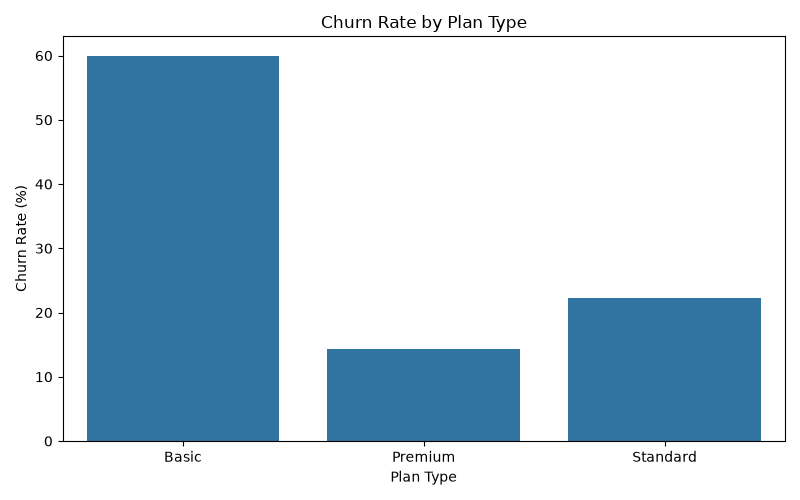
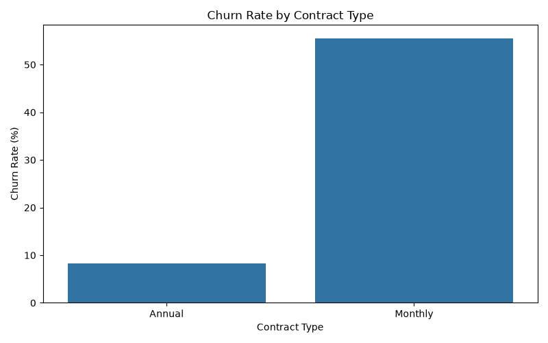
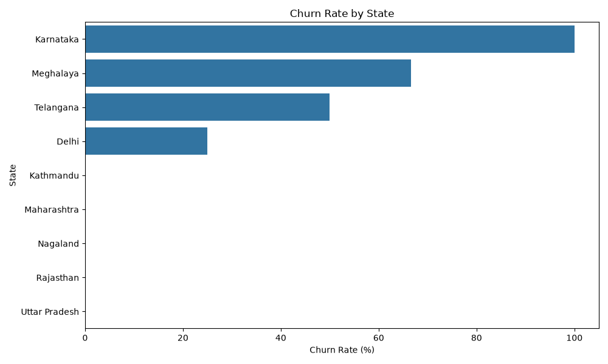
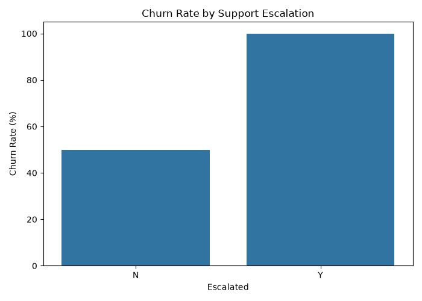
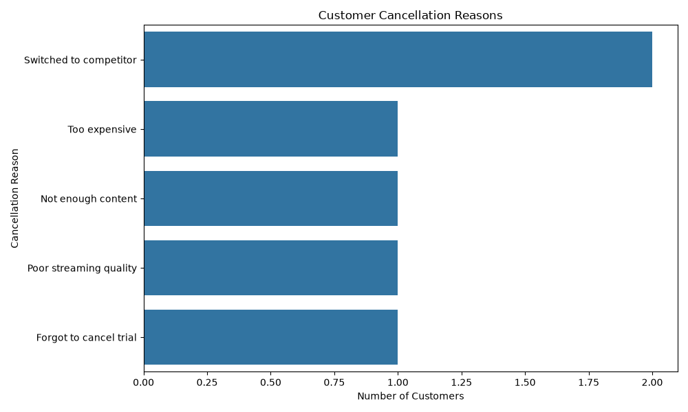
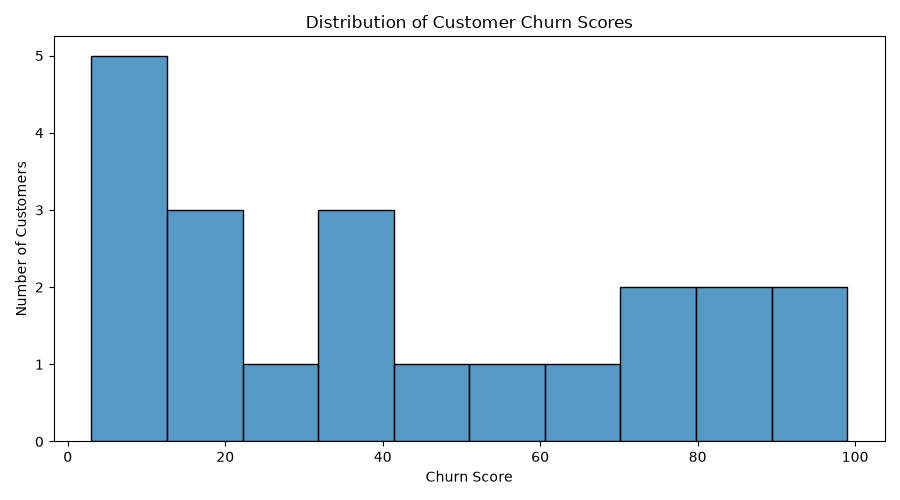

# Customer Churn Analysis & Customer Intelligence

## Project Overview

This project analyzes customer churn for an OTT/subscription-based business using customer demographics, subscription behavior, and customer-support interactions.

The objective is to identify:

* which customers are more likely to churn
* which subscription segments have the highest churn
* whether contract type influences churn
* which geographic regions show higher churn
* whether support escalations are associated with churn
* why customers cancel their subscriptions
* how much monthly revenue is exposed to high-risk customers

The project follows an end-to-end analytics workflow using **SQLite, Python, Pandas, Matplotlib, and Seaborn**.

---

## Business Problem

Customer retention is critical for subscription businesses because churn reduces recurring revenue and customer lifetime value.

This project focuses on three main questions:

**Who?**
Which customers and customer segments are most likely to churn?

**Why?**
Which subscription, cancellation, and support factors are associated with churn?

**Where?**
Which plans, contract types, and geographic regions show the highest observed churn?

---

## Tech Stack

* Python
* Pandas
* NumPy
* SQLite
* sqlite3
* Matplotlib
* Seaborn
* VS Code
* Git
* GitHub

---

## Dataset

The SQLite database contains three relational tables.

### `db_customer`

Contains customer demographic information.

Key columns:

* `customerid`
* `name`
* `country`
* `state`
* `gender`
* `dob`
* `interests`
* `pincode`

### `db_subscription`

Contains subscription and churn-related information.

Key columns:

* `customerid`
* `subscription_start_date`
* `subscription_type`
* `renewal_date`
* `plan_type`
* `contract_type`
* `cancellation_date`
* `cancellation_reason`
* `monthly_charges`
* `cltv`
* `churn_score`

### `db_support`

Contains customer-support interactions.

Key columns:

* `customerid`
* `complaint_date`
* `escalations`
* `csat_score`
* `comment`

All three tables are connected using `customerid`.

---

## Project Structure

```text
customer-churn-analysis/
│
├── data/
│   ├── raw/
│   │   └── customer_churn_data_raw.xlsx
│   │
│   └── database/
│       └── customer_churn.db
│
├── outputs/
│   └── charts/
│       ├── churn_by_plan.png
│       ├── churn_by_contract.png
│       ├── churn_by_state.png
│       ├── churn_by_escalation.png
│       ├── cancellation_reasons.png
│       └── churn_score_distribution.png
│
├── src/
│   ├── extract.py
│   ├── clean.py
│   ├── feature_engineering.py
│   ├── analysis.py
│   └── visualization.py
│
├── notebooks/
├── sql/
├── .gitignore
├── requirements.txt
└── README.md
```

---

## Analytics Pipeline

```text
SQLite Database
      ↓
Data Extraction
      ↓
Data Quality Checks
      ↓
Data Cleaning
      ↓
Feature Engineering
      ↓
KPI Analysis
      ↓
Segment Analysis
      ↓
Data Visualization
      ↓
Business Insights
```

---

## 1. Data Extraction

The SQLite database is connected to Python using the built-in `sqlite3` module.

SQL queries are executed and loaded into Pandas DataFrames using:

```python
pd.read_sql_query()
```

Three DataFrames are created:

```python
df_customer
df_subscription
df_support
```

This provides the bridge between relational SQL data and Python-based analytics.

---

## 2. Data Quality Checks

Before applying transformations, each table was inspected for:

* number of rows and columns
* column names
* data types
* missing values
* duplicate rows
* categorical inconsistencies

### Customer Table

The customer table contains 21 rows and 8 columns.

The initial inspection identified:

* `dob` stored as text
* 3 missing `country` values
* 17 missing `interests` values
* 21 missing `pincode` values
* no duplicate rows

Because `pincode` was completely empty and `interests` was approximately 81% missing, both were removed from the analytical dataset.

### Subscription Table

The subscription table contains 21 rows and 11 columns.

The inspection identified:

* subscription date fields stored as strings
* 15 missing `cancellation_date` values
* 15 missing `cancellation_reason` values
* no duplicate rows

The cancellation nulls were preserved because they represent active customers rather than missing or corrupted data.

### Support Table

The support table contains 9 rows and 6 columns.

The inspection identified:

* `complaint_date` stored as text
* `col_1` completely null
* 5 missing support comments
* no duplicate rows

The empty `col_1` field was removed.

---

## 3. Data Cleaning

A reusable function named:

```python
load_and_clean_data()
```

was created inside `clean.py`.

The cleaning stage performs:

* datetime conversion
* removal of unusable columns
* correction of categorical inconsistencies
* preservation of meaningful business null values

Examples:

```python
df_customer["dob"] = pd.to_datetime(df_customer["dob"])
```

and:

```python
df_customer = df_customer.drop(
    columns=["pincode", "interests"]
)
```

The subscription date fields and complaint date are also converted to datetime.

The cleaned DataFrames are returned for reuse by later stages of the pipeline.

---

## 4. Feature Engineering

A reusable function named:

```python
engineer_features()
```

creates new analytical fields from the cleaned data.

### Customer Age

`customer_age` is calculated from `dob`.

The calculation also checks whether the customer's birthday has already occurred in the current year to avoid overestimating age by one year.

### Churn Flag

A binary churn feature was created:

```text
1 = Churned
0 = Active
```

The flag is derived from whether `cancellation_date` is present.

### Customer Tenure

A temporary tenure end date is created.

For churned customers:

```text
tenure end date = cancellation date
```

For active customers:

```text
tenure end date = current date
```

Tenure is then calculated as:

```text
tenure_days =
tenure_end_date - subscription_start_date
```

The temporary helper column is dropped after `tenure_days` is created.

---

## 5. Core KPIs

The analysis produces the following results from the current dataset.

| KPI                                         |            Result |
| ------------------------------------------- | ----------------: |
| Churn Rate                                  |        **28.57%** |
| Retention Rate                              |        **71.43%** |
| Average Customer Tenure                     | **1,525.86 days** |
| ARPU                                        |         **21.46** |
| Revenue at Risk                             |         **73.94** |
| Escalation Rate                             |        **55.56%** |
| Average Complaints per Complaining Customer |          **1.29** |

### Churn Rate

```text
Churned Customers / Total Customers × 100
```

The observed churn rate is **28.57%**.

### Retention Rate

```text
100 - Churn Rate
```

The observed retention rate is **71.43%**.

### Average Customer Tenure

Average tenure is calculated using the engineered `tenure_days` field.

The current result is **1,525.86 days**.

Because active customers use the current date as their tenure endpoint, this metric will change slightly when the analysis is rerun in the future.

### ARPU

Average Revenue Per User is calculated for active customers:

```text
Total Monthly Charges from Active Customers
/
Number of Unique Active Customers
```

The resulting ARPU is **21.46**.

### Revenue at Risk

Customers with:

```text
churn_score > 70
```

are treated as high-risk customers.

Their combined monthly charges total **73.94**, representing monthly revenue exposed to potential churn.

---

## 6. Churn by Plan Type



Observed churn rates by plan:

| Plan Type | Churn Rate |
| --------- | ---------: |
| Basic     | **60.00%** |
| Standard  | **22.22%** |
| Premium   | **14.29%** |

The **Basic plan has the highest observed churn rate**.

This suggests that Basic-plan customers may require additional retention attention.

Possible areas for investigation include:

* perceived plan value
* content availability
* pricing
* onboarding quality
* upgrade incentives

---

## 7. Churn by Contract Type



Observed churn rates by contract:

| Contract Type | Churn Rate |
| ------------- | ---------: |
| Monthly       | **55.56%** |
| Annual        |  **8.33%** |

Monthly subscribers churn approximately **6.67 times** as often as annual subscribers.

This is one of the strongest patterns in the dataset.

A possible retention strategy is to encourage suitable monthly customers to migrate toward annual contracts using:

* annual-plan discounts
* loyalty incentives
* renewal benefits
* bundled offers

---

## 8. Geographic Churn Analysis



Observed churn rates by state:

| State         |  Churn Rate |
| ------------- | ----------: |
| Karnataka     | **100.00%** |
| Meghalaya     |  **66.67%** |
| Telangana     |  **50.00%** |
| Delhi         |  **25.00%** |
| Kathmandu     |   **0.00%** |
| Maharashtra   |   **0.00%** |
| Nagaland      |   **0.00%** |
| Rajasthan     |   **0.00%** |
| Uttar Pradesh |   **0.00%** |

Karnataka shows the highest observed churn rate in the dataset, followed by Meghalaya and Telangana.

However, the entire dataset contains only 21 customers.

Therefore, these geographic results should be treated as **exploratory signals rather than population-level conclusions**. A 100% churn rate in a state may represent only a very small number of customers.

---

## 9. Support Analysis

### Escalation Rate

The observed escalation rate is:

**55.56%**

This means more than half of the recorded support interactions were escalated.

### Average Complaints per Complaining Customer

The dataset contains an average of:

**1.29 complaints per complaining customer**

This indicates that some customers contacted support more than once.

### Churn by Escalation Status



Observed churn rates in the support sample:

| Escalation Status |  Churn Rate |
| ----------------- | ----------: |
| No Escalation     |  **50.00%** |
| Escalated         | **100.00%** |

Customers associated with escalated support interactions showed substantially higher observed churn in the available support data.

Because the support table contains only a small number of customers, this result should be interpreted as an **association in the sample**, not evidence that escalation directly causes churn.

---

## 10. Cancellation Reasons



Recorded cancellation reasons were:

| Cancellation Reason    | Customers |
| ---------------------- | --------: |
| Switched to competitor |     **2** |
| Too expensive          |     **1** |
| Not enough content     |     **1** |
| Poor streaming quality |     **1** |
| Forgot to cancel trial |     **1** |

There are six recorded cancellations.

**Switching to a competitor is the most frequently recorded cancellation reason**, accounting for 2 of the 6 cancellations.

This represents approximately **33.3% of recorded cancellations**.

The remaining reasons suggest several different churn drivers:

* pricing sensitivity
* content dissatisfaction
* product or streaming-quality problems
* trial-management behavior

---

## 11. Churn Score Distribution



The churn-score histogram shows customers distributed across different levels of churn risk.

The existing churn score can be used to segment customers into groups such as:

```text
Low Risk
Medium Risk
High Risk
```

High-risk customers can then be prioritized using additional business measures such as:

* CLTV
* monthly charges
* contract type
* complaint history
* escalation history

---

## Key Business Insights

The main findings from the analysis are:

* Overall churn is **28.57%**
* Retention is **71.43%**
* Average customer tenure is **1,525.86 days**
* Active-customer ARPU is **21.46**
* High-risk customers represent **73.94 in monthly revenue at risk**
* Basic-plan customers have the highest observed plan churn at **60.00%**
* Monthly subscribers churn at **55.56%**
* Annual subscribers churn at only **8.33%**
* Monthly churn is approximately **6.67×** annual churn
* Karnataka has the highest observed geographic churn in the available sample
* **55.56%** of recorded support interactions were escalated
* Customers with escalated support interactions showed **100% observed churn** in the support sample
* Switching to a competitor is the most common recorded cancellation reason

---


## Skills Demonstrated

This project demonstrates practical experience with:

* SQL database integration
* relational data analysis
* SQLite
* Python analytics workflows
* Pandas DataFrames
* data-quality assessment
* missing-value analysis
* data cleaning
* datetime transformation
* feature engineering
* customer churn analysis
* KPI development
* segmentation analysis
* revenue-at-risk analysis
* customer-support analytics
* Matplotlib
* Seaborn
* Git version control
* GitHub
* converting analytical findings into business recommendations


